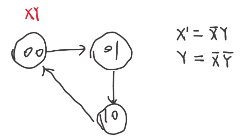

# 硬件视角的操作系统


操作系统有三条主线：“软件 (应用)”、“硬件 (计算机)”、“操作系统 (软件直接访问硬件带来麻烦太多而引入的中间件)”。我们已经理解了操作系统上的应用程序的本质 (状态机)。而程序最终是运行在计算机硬件上的；因此有必要理解什么是计算机硬件，以及如何为计算机硬件编程。

本讲内容：计算机硬件的状态机模型；回答以下问题：
- 什么是计算机硬件？
- 计算机硬件和程序员之间是如何约定的？
- 听说操作系统也是程序。那到底是鸡生蛋还是蛋生鸡？

硬件和软件之间的约定，直接在计算机硬件上编程。用IDE编程，许多细节是隐藏的，但是如何写一段能直接在硬件上运行的代码呢？

## 数字电路与计算机

数字电路是什么？
- 一个非常简单的公里系统（导线、始终、逻辑门、触发器）
- 建立在公理体系上的数字系统设计

公理很简单，一个星期学会，接下来就是写 Verilog，数字系统和数学像，再公理系统上可以建立好玩的东西，做出好玩的东西不简单。比如编程语言语法不难，但是实现一个花里胡哨的东西还是挺难的，这就是经验。

整个计算机系统和数字逻辑电路是有深刻的等价性的。

数字电路里会特别强调状态机这个东西。举个简单的例子：

<figure>
  
</figure>

态机，每个状态的转移就是个时钟周期。从这个角度来看

状态就是寄存器和内存里的值，初始状态就是系统 RESET 的值。FPGA里搞的话，reset成 undefined 或者 0 都没问题。状态迁移就是组合逻辑电路计算寄存器下一周期的值。

计算机系统基础学到了，状态机的行为一方面可以用数学表达式，或者**状态转移图**来表示。此外还可以用一段程序来严格的表达。


整个计算机系统也是一个状态机。

状态
- 内存和寄存器数值
- 初始状态(reset)
- 状态迁移

初始状态决定了我们是否可以把自己的程序放在机器上执行。电脑的热启动，单独的一个键，就叫reset。

数字都带有 reset 的。

用C语言去模拟数字电路，状态机的思路

### 1

一个状态机可以用状态转换图来表达，同样也可以用代码来表达：
```c
#define REGS_FOREACH(_)  _(X) _(Y)
#define RUN_LOGIC        X1 = !X && Y; \
                         Y1 = !X && !Y;
#define DEFINE(X)        static int X, X##1;
#define UPDATE(X)        X = X##1;
#define PRINT(X)         printf(#X " = %d; ", X);

int main() {
  REGS_FOREACH(DEFINE);
  while (1) { // clock
    RUN_LOGIC;
    REGS_FOREACH(PRINT);
    REGS_FOREACH(UPDATE);
    putchar('\n'); sleep(1);
  }
}
```

这段代码用了一点 X-micro 。

拿到这种代码第一步是编译，如果C语言基础不太好，可以选择用 GCC 输出预处理文件。
```bash
gcc -E 1.c -o 1.i
```
这是一段容易写出来的代码
```c
int main()
{
  static int X, X1; static int Y, Y1;;
  while (1)
  {
    X1 = !X && Y; Y1 = !X && !Y;;
    printf("X" " = %d; ", X); printf("Y" " = %d; ", Y);;
    X = X1; Y = Y1;;
    putchar('\n'); sleep(1);
  }
}
```
上面是个很小的计算机系统模拟器。

### 2

把他变得更大一点，做一个更好玩的东西：

```c
#include <stdio.h>
#include <unistd.h>

#define REGS_FOREACH(_)  _(X) _(Y)
#define OUTS_FOREACH(_)  _(A) _(B) _(C) _(D) _(E) _(F) _(G)
#define RUN_LOGIC        X1 = !X && Y; \
                         Y1 = !X && !Y; \
                         A  = (!X && !Y) || (X && !Y); \
                         B  = 1; \
                         C  = (!X && !Y) || (!X && Y); \
                         D  = (!X && !Y) || (X && !Y); \
                         E  = (!X && !Y) || (X && !Y); \
                         F  = (!X && !Y); \
                         G  = (X && !Y); 

#define DEFINE(X)   static int X, X##1;
#define UPDATE(X)   X = X##1;
#define PRINT(X)    printf(#X " = %d; ", X);

int main() {
  REGS_FOREACH(DEFINE);
  OUTS_FOREACH(DEFINE);
  while (1) { // clock
    RUN_LOGIC;
    OUTS_FOREACH(PRINT);
    REGS_FOREACH(UPDATE);
    putchar('\n');
    fflush(stdout);
    sleep(1);
  }
}
```

做一个小的后端，接收程序，可视化出来

```py
import fileinput
 
TEMPLATE = '''
\033[2J\033[1;1f
     AAAAAAAAA
    FF       BB
    FF       BB
    FF       BB
    FF       BB
    GGGGGGGGGG
   EE       CC
   EE       CC
   EE       CC
   EE       CC
    DDDDDDDDD
''' 
BLOCK = {
    0: '\033[37m░\033[0m', # STFW: ANSI Escape Code
    1: '\033[31m█\033[0m',
}
VARS = 'ABCDEFG'

for v in VARS:
    globals()[v] = 0
stdin = fileinput.input()

while True:
    exec(stdin.readline())
    pic = TEMPLATE
    for v in VARS:
        pic = pic.replace(v, BLOCK[globals()[v]]) # 'A' -> BLOCK[A], ...
    print(pic)
```

```bash
./a.out | python3 2-2.py
```
上面完成了一个简单数字电路模拟，同时岩石了两个程序之间的通信，完成了一次配合工作。

这就是程序。

很简单，但是好像创造了一些从没见过的东西。

顺便，体验了 unix 的哲学：
- Make each program do one thing well
- Expect the output of every program to become the input to another

这就代表了整个计算机系统。

### 3

更接近业务的实现

```c
#include <stdio.h>
#include <stdbool.h>
#include <unistd.h>

typedef bool wire; // Wires
typedef struct {
  bool value;
  wire *in, *out;
} reg; // Flip-flops

// Circuit constructs
#define CLOCK       for (; ; END_CYCLE)
#define NAND(X, Y)  (!((X) && (Y)))
#define NOT(X)      (NAND(X, 1))
#define AND(X, Y)   (NOT(NAND(X, Y)))
#define OR(X, Y)    (NAND(NOT(X), NOT(Y)))

// Circuit emulation helpers
#define END_CYCLE ({ end_cycle(); putchar('\n'); fflush(stdout); sleep(1); })
#define PRINT(X) printf(#X " = %d; ", X)

// Wire and register specification
wire X, Y, X1, Y1, A, B, C, D, E, F, G;
reg b1 = {.in = &X1, .out = &X};
reg b0 = {.in = &Y1, .out = &Y};

// Dump wire values at the end of each cycle
void end_cycle() {
  PRINT(A); PRINT(B); PRINT(C); PRINT(D);
  PRINT(E); PRINT(F); PRINT(G);
}

int main() {
  CLOCK {
    // 1. Wire network specification (logic gates)
    X1 = AND(NOT(X), Y);
    Y1 = NOT(OR(X, Y));
    A = D = E = NOT(Y);
    B = 1;
    C = NOT(X);
    F = Y1;
    G = X;

    // 2. Lock data in flip-flops and propagate output to wires
    b0.value = *b0.in;
    b1.value = *b1.in;
    *b0.out = b0.value;
    *b1.out = b1.value;
  }
}
```

## CPU 复位与固件

为了让 “操作系统” 这个程序能够正确启动，计算机硬件系统必定和程序员之间存在约定——首先就是 Reset 的状态，然后是 Reset 以后执行的程序应该做什么。这么想，计算机硬件和操作系统就一点也不神秘了。


## 调试 MBR 代码


## 编译运行操作系统内核


