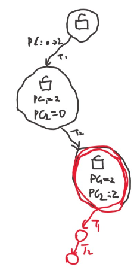
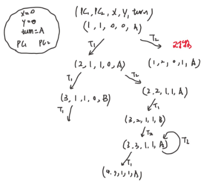

# 并发问题

如果我们作为这个问题的发现者，会如何尝试去解决这个问题？从软件上 or 硬件上？

并发编程困难不代表我们只能摆烂——我们还可以创造出新的手段，帮助我们编写正确的并发程序：
- 互斥问题和 Peterson 算法
- Peterson 算法的正确性和模型检验
- Peterson 算法在现代多处理器系统上的实现
- 实现并发控制的硬件和编译器机制


如何更深刻的理解并发程序的执行？画状态机。

## 画状态机理解并发

一个互斥算法。互斥即保证两个线程不能同时执行一段代码。

比如说，前面的 sum.c ，插入神秘代码，使得能正常工作。

```c
void Tsum()
{
    //神秘代码
    sum++;
    //神秘代码
}
```

这时候就可以正确运行了。这是我们想要的。

这里只允许用内存的读和写，即 load 和 store 来实现这个事情，如何实现共享内存上的互斥。

先来看一个失败的实现：
```c
int locked = UNLOCK;

void critical_section() {
retry:
/*0*/  if (locked != UNLOCK) {
/*1*/    goto retry;
        }
/*2*/  locked = LOCK;

  // critical section

  locked = UNLOCK;
}
```
这个山寨支付宝的错误一样，两个线程同时进入判断是有可能的。这种不等于的判断和比大小的判断没什么本质区别。

如何证明？画个状态机，

<figure>
  
</figure>

因为load和store不能原子的完成。如果状态机可以一步完成这个事情，那么就可以办到了，然而不是。

### Peterson 算法

提出了一种互斥的协议。

他的模型是共享内存模型，每次可以store一个变量，或者load看一个变量的值。
- store 改变状态，比如举起旗子，贴个牌子
- load 看一眼旗子，便签

当然还有个根本的假设，看到的东西是过去发生的，只代表过去某个时候的历史，回过头就有可能变化。

比如说，两个人去争抢厕所包厢。如果同时进去了，就比较麻烦，所以设计一种方法，可以一个人安全的进入。

- 想进入包厢之前，A/B 都要先举起自己的旗子
  - A 确认旗子举好以后，往厕所门上贴上 “B 正在使用” 的标签
  - B 确认旗子举好以后，往厕所门上贴上 “A 正在使用” 的标签
- 然后，如果对方的旗子举起来，且门上的名字不是自己，等待
  - 否则可以进入包厢
- 出包厢后，放下自己的旗子
- 
用旗子来表明谁想上厕所，用标签来决定谁可以上厕所。

如何证明这个协议是正确的呢？如果对，如何给证明？如果不对怎么给反例？

首先，如果我举了旗子，贴了标签，舍友没举旗子，那没有任何问题。

问题在我和舍友都举起了旗子，两人闭着眼把标签往门上贴。所以精髓是，谁手快，谁就可以上厕所。

这些文字是不太正式的证明。但是如果出一份试卷，搞上来这么多答案，这好像不太行。


给个证明更好的办法：

把这个算法写出来，当然运行起来也可以。想要证明一个程序的正确性，会更容易。

状态机。

是不是可以把状态机所有可能的状态都画出来，所有的状态里如果都没有两个线程同时执行一个代码，那么就会说这个算法是正确的。

<figure>
  
</figure>

然而这段代码会触发错误，指令重排了。

在加上barrier看起来不会出问题。但是如果没有barrier就会看到运行了一定次数会出错。

可以看到，并发编程还是挺困难的。


