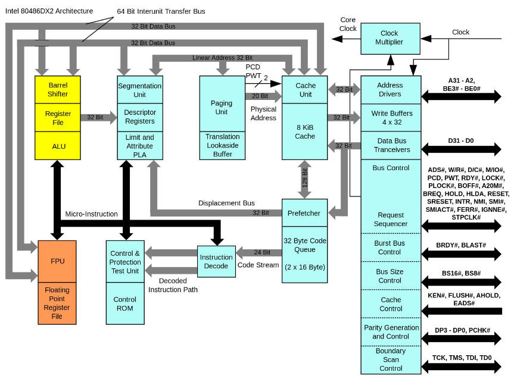

# 并发控制：互斥


前面所有的东西都在强化状态机这个观念。

并且去理解状态机的执行：画图。

前面的 Peterson 算法实现互斥的效率是很低的，在多处理器上实现互斥，还需要一些新的机制。

这部分来回答如何在多处理器上实现线程的互斥。

这部分内容，两种锁的实现：自旋锁、互斥锁。

现代多处理器系统上的互斥实现：
- 互斥问题的定义和假设
- 自旋锁
- 互斥锁和 Futex

## 回顾

在共享内存上实现的互斥。

物理世界是个状态机，“生命游戏”。

- 线程=人
- 共享内存=物理世界(世界里的人天生并行)

物理世界没有这种机制去保护资源，必须说我要去拿舍友的钱包，直接拿就行。

Peterson 算法是个协议，实现两个人上一个坑位。

互斥在保持资源的独占性。互斥锁=厕所包间的锁。

但是在共享内存上实现互斥并不容易，实现互斥的根本困难：不能同时读/写共享内存
- load(看)，环顾四周的时候不可以写，而且，看一眼马上就闭眼。对于计算机来说，看到的东西马上就过时了。
- store(改变物理世界的状态)，不可以看，只能闭着眼睛动手，而且计算机也不知道把什么改成了什么

原子性，即使一条 ADD 的汇编指令，现代CPU也会把这个拆成指令来执行。

当然这是操作系统课，用简单粗暴的算法解决问题，不是算法课研究互斥算法。

什么解决办法呢？

## 自旋锁(spin lock)

提出算法，或者直接解决提出问题的人(如果假设太强，能不能改变假设)。

能不能让硬件帮忙多做一点点事。硬件为我们提供一条“瞬间完成”读和写的指令。
- 所有人闭眼，看一眼(load) 然后贴上标签(store)
  - 多人同时请求，硬件挑出一个获胜者
  - 失败者等待执行完成后才能继续执行

当然这是有代价的，这意味着所有人的地位是对等的。

内联汇编，前加 `lock` ，事实上，这个指令也并不需要让其让所有CPU真的停下，只要保证不动我要操作的事情就可以了。

有更多的x86原子操作,

现在再来考虑经典的上厕所问题。现在有了原子指令，如何实现互斥呢？

一个宿舍4个人，一个厕所包间，包间每一时刻都只有一个人入内。

在厕所门口放一个桌子(共享变量)，实现互斥的协议：
- 想上厕所的同学(一条 `xchg` 指令，自带互斥)
  - 天黑请闭眼，所有人不要动，不要看，不要摸
  - 看一眼桌子上有啥东西(🔑或者🈲)
  - 随便手上什么东西，交换桌上的🔑，把🈲放到桌上
  - 其他同学，看到🔑才能进厕所包厢
- 出厕所以后，
  - 把🔑放回桌上

所以任何一个后面的同学，想进厕所，也会做 `xchg` 得不到🔑，那么就无法进入。

如果硬件给我们一些机制的话，我们就可以把协议实现的更加简单。


如果表达成代码的形式呢？

```c
int table = YES; //可以进入

void lock() {
retry:
  int got = xchg(&table, NOPE);
  if (got == NOPE)
    goto retry;
  assert(got == YES);
}

void unlock() {
  xchg(&table, YES)
}
```

在精简一下
```c
int locked = 0;
void lock() { while (xchg(&locked, 1)) ; }
void unlock() { xchg(&locked, 0); }
```

通常，读代码的话，遇到的是下面的代码。如果初次学习遇到的是下面的代码，那么会花许多时间理解。但是上面进厕所的例子却是个很自然的想法。

尽管如此，我们实现并发的时候，还是要很小心。

这就是操作系统里面要用到的自旋锁。就这这么简单。


再来看原子指令。

源自指令的模型，处理器会去保证所有带 `lock` 的指令会排出一个先后顺序。
- 保证之前的 store 都写入内存
- 保证 load/store 不与原子指令乱序

原子指令如何在CPU上实现呢？

在 486 时代，支持 dual-socket 了，一块主板上插两个 CPU，这时候想想如何处理两个 CPU 同时访问内存的问题。只需要在 memory 上上一把🔒就行，两个CPU同时加锁，总线会决定。

<figure>
  
</figure>

因此，lock这个前缀的设计是有道理的，读到lock指令，先上锁，这个设计非常自然。

所以这也有了今天的lock指令。

这条指令也让现在的CPU设计很有负担，486时代，cache在主板上，现代CPU自己有cache，甚至一级和二级，还有三级，这时候 `lock` 实现起来就很麻烦。

今天intel处理器，缓存的一致性是体系结构的很大包袱，所有的L1缓存都是连起来的。

与此相比，RISC-V 有一种更聪明的实现方法。原子指令的需求是，一个 读(load)，一个写，比如常见的一些原子操作
- atomic test-and-set
  - reg = load(x); if (reg == XX) {store(x,YY);}
- lock xchg
  - reg = load(x); store(x, XX)
- lock add
  - t = load(x); t++; store(x,t);

他们的本质都是load，寄存器操作，store。原子的本质就是原子的一读一写。

聪明设计：Load-Reserved/Store-Conditional(LR/SC)

做一次读和做一次写，读完做一个标记，本地计算算完后会去真正的写他，写的时候只有在标记还在的时候才去做。

发现标记被破坏了，那就重复一次。

这就可以实现任何一个原子的读写操作。这个方法还可以检测原子操作的拥堵。失败了就代表有人在和我并发的做这个事情。


## 互斥锁


自旋锁的缺陷：
- 性能问题
  - 自旋(共享变量)会触发处理期间的缓存同步，延迟增加
  - 除了进入临界区的线程，其他处理器上的线程都在空转。两个线程同时抢一把锁，另一个在死循环，这得浪费许多cpu cycle。争抢锁的处理器越多，利用率越低。
  - 获得自旋锁的线程可能被操作系统切换出去
    - 单操作系统不“感知”线程在做啥
    - 拿着钥匙回去睡觉了，其他人在等着上班
    - 实现了100%的资源浪费

并发编程，评价好坏，scalability，伸缩性，随着CPU或者线程的数量变化，运行的时间和内存会有什么样的变化？


自旋锁的使用场景：
- 临界区几乎不拥堵。不会发生锁的争抢，几乎只有一个线程进入临界区。
  - 比如一个队列，去用几个ns，算用几个ms
- 持有自旋锁时禁止执行流切换
  - 但是应用程序做不到，如果可以，意味着写个while(1) 就能卡死cpu


使用场景：操作系统内核的并发数据结构(短临界区)，操作系统可以决定不要切换，中断也不要来。
- 操作系统可以关闭中断和抢占
  - 保证锁的持有者在很短时间内可以释放
- 有时候这个中断并不是真的关掉了，比如虚拟机，

自旋锁的使用是个很大的难题，在2010年还可以发一篇计算机的顶会，OSDI，来说linux的自旋锁使用的有多烂。

如果希望实现很长的临界区，比如说，写一个文件，别人不要写这个文件。这是个很自然的需求，那该怎么办呢？与其干等着上厕所，不如先去吃个饭，回来再看看厕所门的钥匙在不在桌上。

对于linux的线程来说，想实现长临界区的互斥很简单，加一个系统调用就好了。把锁的实现放到系统调用里
- `syscal(SYSCALL_lock, &lk)`
  - 试图获得 lk，但如果失败，就切换其他线程
- `syscal(SYSCALL_unlock, &lk)`
  - 释放 lk，如果有等待的线程就唤醒线程


操作系统就是更衣室的管理管
- 先到的人(线程)
  - 成功获得手环，进入游泳馆
  - `*lk = 🔒` 系统调用直接返回
- 后到的人
  - 不能进入游泳馆，排队等待
  - 线程放入等待队列，执行线程切换
- 洗完澡出来的人
  - 交换手环到管理员，管理员把手环给排队的人
  - 等待队列有人，取出一个线程允许执行
  - 等待队列为空，`*lk = ⚪`

管理员使用自旋锁确保自己处理手环是原子的。


## Futex = Spin + Mutex

自旋锁有个好处，快的时候很快
- 更快的 fast path
  - 一条指令就进入了，开销小
- 更慢的 slow path
  - xchg 不停交换没用的东西，浪费CPU自选等待

睡眠锁
- 更快的 slow path
  - 上锁失败线程不再占用CPU
- 更慢的fast path
  - 上锁成功也需要进出内核

我们又想快的时候一条指令进入，又不想进系统调用，该怎么办呢？

Futex
- fast path 一条原子指令，上锁成功立即返回
- slow path 上锁失败，执行系统调用睡眠
  - 这也是性能优化最常见的技巧

```note
问题求解课，性能优化。 
```

POSIX 线程库中的互斥锁，(pthread_mutex)
- 观察系统调用strace


