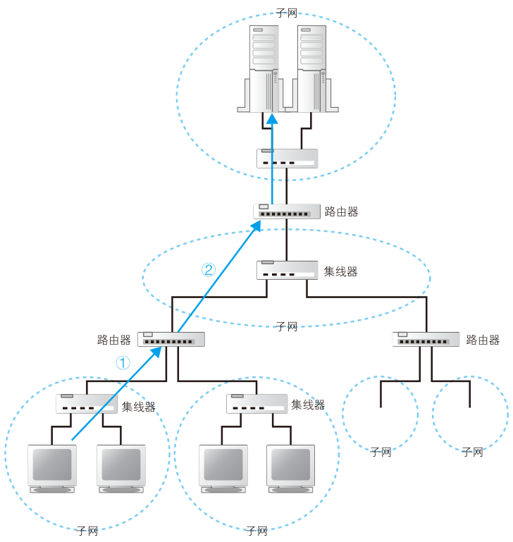

# DNS 服务器

有了http消息，接下来要委托操作系统将消息发送给web服务器，浏览器能解析网址生成http消息，但是本身并不具备将消息发送到网络中的功能。

不仅仅浏览器需要发送消息，QQ，下载软件，游戏等都需要发送消息，因此这个功能让操作系统来实现更合适。

在发送消息前，还有件事情要做，查询网址中服务器域名对应的IP地址。在委托操作系统发送消息时，给的不是域名而是IP地址，因此需要根据域名查询IP地址。

## IP地址

互联网和公司内部的局域网都是基于TCP/IP的思路来设计的，一些小的子网连接起来组成大的网络。结构如下图：

<figure>
    
</figure>

子网可以理解为用集线器连接起来的几台计算机，将子网通过路由器连接起来，就形成了一个网络。

```note
集线器是一种对包进行转发的设备，分为中继式集线器和交换式集线器两种。

路由器是一种对包进行转发的设备。

交换机也是一种对包进行转发的设备。

具体区别，后面说。
```

网络中，所有设备都会被分配一个IP地址。地址分割为**网络号**和**主机号**。网络号是分配给整个子网的，主机号是给子网中的一台计算机的。

通过IP地址可以判断访问对象服务器的位置，从而将消息发送到服务器。后面会更加详细的说整个过程，这里简单看看。消息先经过子网的集线器，到达距离最近的路由器，路由器根据消息的目的地判断下一个路由器位置，经过子网的集线器发送到下一个路由器，知道传送到目的地为止。

实际的IP地址是一串32bit的数字，1Byte一个组分为4组，写成10进制后圆点隔开就是常见的IP格式。I

192.168.10.11

仅靠IP地址无法区分哪部分是网络号，哪部分是主机号。这两部分总共32bit但是并不固定，可以自己分配，因此需要**子网掩码**来指出网络号占用的bit位。

子网掩码为1的部分表示网络号，为0的部分表示主机号。IP地址的主机号为0代表的是整个子网而非单台计算机，主机号全为1代码向子网所有设备发送消息即广播。


## 域名与IP共存

TCP/IP网络通过IP地址来确定通信对象，不知道IP就无法发送消息。

既然如此，在网址中直接写IP地址就好了，IP地址代替网址是可以正常工作的，下面这个IP地址指向baidu

http://202.108.22.5/

然而这并不好记忆，这就和电话号码与联系人的关系一样。如果在互联网中不用IP地址，直接使用名称确定通信对象呢？这并不是个好方法，效率上可能并不高。毕竟使用IP地址只需要4Byte就能解决，使用字符串保存名称的话，4Byte显然不太够用。何况，域名不仅仅长，长度还是不固定的。

于是，有了现在的方案，让人来使用域名，让路由器使用IP地址，为了联系人和机器，需要一个机制来把域名和IP地址对应起来，在人和机器都不做出牺牲的前提下完美解决，这就是DNS(Domain Name System)域名服务系统。

DNS功能并不仅限于把服务器名和IP地址关联，它还可以将邮件地址和邮件服务器进行关联，以及为各种信息关联相应的名称。

## Socket 库提供查询IP地址的方法

查询IP地址很容易，询问最近的DNS服务器就行。浏览器如何向DNS服务器发出请求呢？来探索一下这个事情。

向DNS服务器发出查询，也就是向DNS服务器发送查询消息，接收返回的消息。也就是说有DNS服务器，在我们的计算机上一定有对应的DNS客户端。相当于DNS客户端的部分称为**DNS解析器**（简称解析器）。通过DNS查询IP地址的操作称为**域名解析**(resolution)，因此负责执行解析的这一操作就叫解析器(resolver)了。

解析器是一段程序，包含在操作系统的Socket库中。Socket库里包含的程序组件可以让其他应用程序调用操作系统的网络功能，解析器就是这个库里的一种程序组件。

## 通过解析器向DNS服务器发出查询

解析器用起来很简单，调库嘛，都很容易的。


```c
#include <stdio.h>
#include <stdlib.h>
#include <netdb.h>
#include <sys/socket.h>
#include <netinet/in.h>
#include <arpa/inet.h>
 
int main()
{
    struct hostent *host = gethostbyname("www.baidu.com");
    if(!host)
    {
        puts("Get IP address error!");
        exit(0);
    }
 
    //别名
    for(int i=0; host->h_aliases[i]; i++)
    {
        printf("Aliases %d: %s\n", i+1, host->h_aliases[i]);
    }
 
    //地址类型
    printf("Address type: %s\n", (host->h_addrtype==AF_INET) ? "AF_INET": "AF_INET6");
 
    //IP地址
    for(int i=0; host->h_addr_list[i]; i++)
    {
        printf("IP addr %d: %s\n", i+1, inet_ntoa( *(struct in_addr*)host->h_addr_list[i] ) );
    }
 
    return 0;
}
```


