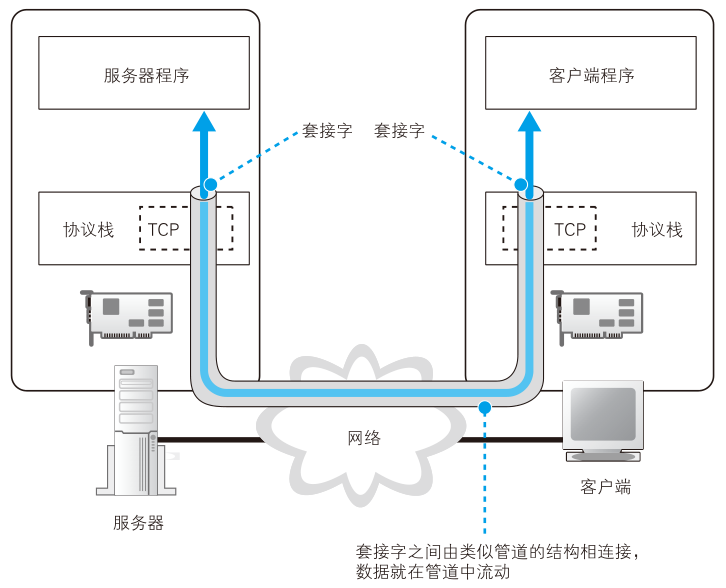
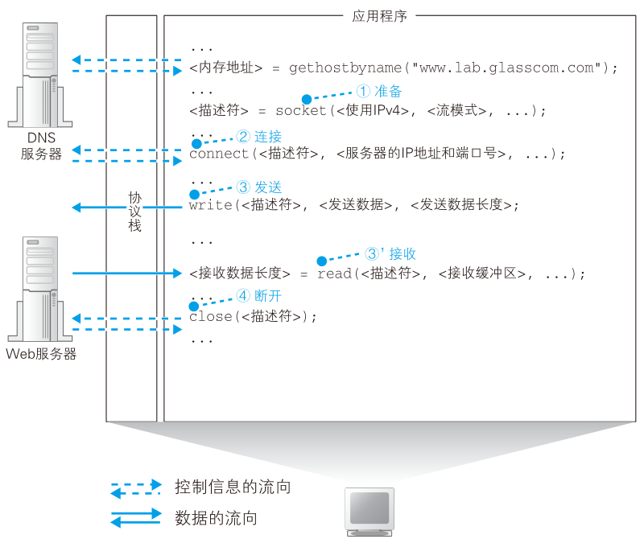

# 协议栈

知道了IP地址之后，就可以委托操作系统内部的协议栈向这个目标IP（web服务器）发送消息了。

收发数据这一操作并不仅限于浏览器，对于各种要使用网络的应用程序来说都是一样的。

收发数据也需要使用Socket库中的程序组件。前面向DNS服务器查询IP地址调用一个组件就行，这里需要按照指定的顺序调用多个程序组件，还挺复杂。发送数据时一系列操作结合起来实现的，先看全貌，就能理解每个具体操作的含义了。


## 数据收发操作全貌

使用Socket库来收发数据的过程如下图：

<figure>
    
</figure>

简单来说，收发数据的两台计算机之间连接了一条数据通道，数据沿着这条通道流动。数据从一端进去就会到达另一端出来，而且是双向的。

从图里来看，这个管道好像一开始就有，其实并不是。在进行收发之前，双方需要先建立起这个管道。实际过程：
- 服务器创建**套接字**，等待客户端向该套接字连接管道
- 将管道连接到服务器的套接字上
- 收发数据
- 断开管道并删除套接字

每个过程都会用到Socket库中的组件。这4个操作都是由操作系统中的协议栈来执行，浏览器等应用程序并不会自己去做管道连接、放入数据的操作，而是委托协议栈代劳。

这部分的内容只是研究如何如何“委托”，协议栈收到委托之后连接管道和放入数据会在后面说。


## 创建套接字阶段

访问DNS服务器调用`gethostbyname()`，也叫解析器。而这里要按照一定顺序调用若干个组件。

<figure>
    
</figure>

创建套接字完成后，协议栈会返回一个描述符。描述符用来识别不同的套接字，计算机中会同时进行多个数据的通信操作（打开两个浏览器窗口），就需要两个套接字。

创建套接字后，只要出示描述符，协议栈就可以判断使用哪一个套接字来连接或者收发数据。

```note
- Socket：
```

## 连接：把管道接上

接下来委托协议栈将客户端创建的套接字域服务器的套机子连接起来。


