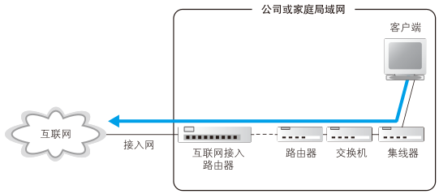
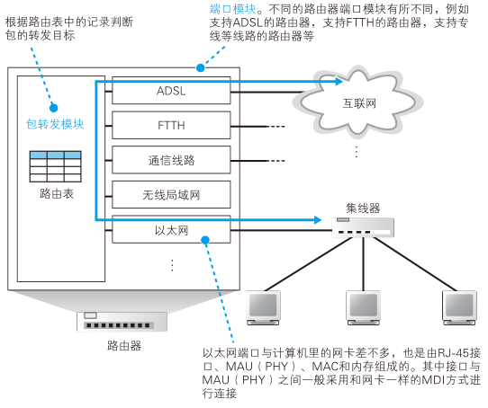

# 路由器

## 路由器的基本知识

<figure>
    
</figure>

网络包经过集线器和交换机之后，现在到达了路由器，并在此被转发到下一个路由器。这一步转发的工作原理和交换机类似，也是通过查表判断包转发的目标。不过在具体的操作过程上，路由器和交换机是有区别的。因为路由器是基于 IP 设计的，而交换机是基于以太网设计的。IP 和以太网的区别在很多地方都会碰到，我们稍后再具体讲，现在先来看看路由器的概况。

首先，路由器的内部结构如图所示。这张图已经画得非常简略了，大家只要看明白路由器包括转发模块和端口模块两部分就可以了。

<figure>
    
</figure>

其中转发模块负责判断包的转发目的地，端口模块负责包的收发操作。这一分工模式在前面介绍计算机内部结构的时候也出现过，换句话说，路由器转发模块和端口模块的关系，就相当于协议栈的 IP 模块和网卡之间的关系。因此，大家可以将路由器的转发模块想象成 IP 模块，将端口模块想象成网卡。

