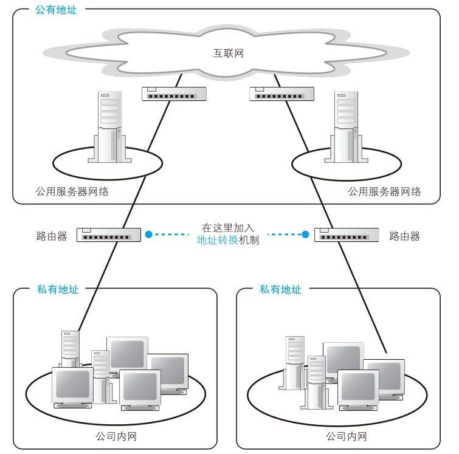

# 路由器的其他功能

## 通过地址转换有效利用 IP 地址

刚才我们介绍了路由器的基本工作过程，现在的路由器除了这些基本功能之外，还有一些附加功能。下面来介绍两种最重要的功能——地址转换和包过滤。

首先，我们先了解一下地址转换功能出现的背景。所谓地址，就是用来识别每一台设备的标志，因此每台设备都应该有一个唯一不重复的地址，就好像如果很多人的地址都一样，那么快递员就不知道该把包裹送给谁了。

网络也是一样，本来互联网中所有的设备都应该有自己的固定地址，而且最早也确实是这样做的。比如，公司内网需要接入互联网的时候，应该向地址管理机构申请 IP 地址，并将它们分配给公司里的每台设备。换句话说，那个时候没有内网和外网的区别，所有客户端都是直接连接到互联网的。

尽管互联网原本是这样设计的，但进入 20 世纪 90 年代之后，互联网逐步向公众普及，接入互联网的设备数量也快速增长，如此一来，情况就发生了变化。如果还用原来的方法接入，过不了多久，可分配的地址就用光了。如果不能保证每台设备有唯一不重复的地址，就会从根本上影响网络包的传输，这是一个非常严重的问题。如果任由这样发展下去，不久的将来，一旦固定地址用光，新的设备就无法接入了，互联网也就无法继续发展了。

解决这个问题的关键在于固定地址的分配方式。举个例子，假如有 A、B 两家公司，它们的内网是完全独立的。这种情况下，两家公司的内网之间不会有网络包流动，即使 A 公司的某台服务器和 B 公司的某台客户端具有相同的 IP 地址也没关系，因为它们之间不会进行通信。只要在每家公司自己的范围内，能够明确判断网络包的目的地就可以了，是否和其他公司的内网地址重复无关紧要，只要每个公司的网络是相互独立的，就不会出现问题。

解决地址不足的问题，利用的就是这样的性质，即公司内部设备的地址不一定要和其他公司不重复。这样一来，公司内部设备就不需要分配固定地址了，从而大幅节省了 IP 地址。当然，就算是公司内网，也不是可以随便分配地址的，因此需要设置一定的规则，规定某些地址是用于内网的，这些地址叫作私有地址，而原来的固定地址则叫作公有地址。

私有地址的规则其实并不复杂，在内网中可用作私有地址的范围仅限以下这些。
- 10.0.0.0 ～ 10.255.255.255
- 172.16.0.0 ～ 172.31.255.255
- 192.168.0.0 ～ 192.168.255.255
  
在制定私有地址规则时，这些地址属于公有地址中还没有分配的范围。换句话说，私有地址本身并没有什么特别的结构，只不过是将公有地址中没分配的一部分拿出来规定只能在内网使用它们而已。这个范围中的地址和其他公司重复也没关系，所以对于这些地址不作统一管理，不需要申请，任何人都可以自由使用。当然，如果在公司内部地址有重复就无法传输网络包了，因此必须避免在内网中出现重复的地址。

尽管这样的确能节省一部分地址，但仅凭这一点还无法完全解决问题。公司内网并不是完全独立的，而是需要通过互联网和其他很多公司相连接，所以当内网和互联网之间需要传输包的时候，问题就出现了，因为如果很多地方都出现相同的地址，包就无法正确传输了。

<figure>
    
</figure>

于是，当公司内网和互联网连接的时候，需要采用上图这样的结构，即将公司内网分成两个部分，一部分是对互联网开放的服务器，另一部分是公司内部设备。其中对互联网开放的部分分配公有地址，可以和互联网直接进行通信，这一部分和之前介绍的内容是一样的。相对地，内网部分则分配私有地址，内网中的设备不能和互联网直接收发网络包，而是通过一种特别的机制进行连接，这个机制就叫地址转换。

