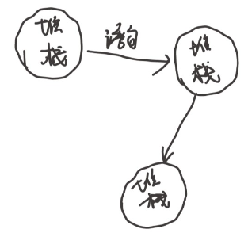
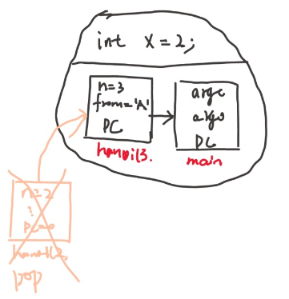

# 操作系统上的程序

到底什么是程序？

```note
前面操作系统概述

- 应用视角 (设计): 一组对象 (进程/文件/...) + API
- 硬件视角 (实现): 一个 C 程序

那么什么是程序和编译器
```

## 数字电路和状态机

```note
计算机系统基础在学什么？

CSAPP

```
整个计算机系统和数字逻辑电路是有深刻的等价性的。

数字电路里会特别强调状态机这个东西。举个简单的例子：

<figure>
  
</figure>

状态机，每个状态的转移就是个时钟周期。从这个角度来看

状态就是寄存器和内存里的值，初始状态就是系统 RESET 的值。FPGA里搞的话，reset成 undefined 或者 0 都没问题。状态迁移就是组合逻辑电路计算寄存器下一周期的值。

计算机系统基础学到了，状态机的行为一方面可以用数学表达式，或者**状态转移图**来表示。此外还可以用一段程序来严格的表达。

### C语言模拟状态机

一个状态机可以用状态转换图来表达，同样也可以用代码来表达：
```c
#define REGS_FOREACH(_)  _(X) _(Y)
#define RUN_LOGIC        X1 = !X && Y; \
                         Y1 = !X && !Y;
#define DEFINE(X)        static int X, X##1;
#define UPDATE(X)        X = X##1;
#define PRINT(X)         printf(#X " = %d; ", X);

int main() {
  REGS_FOREACH(DEFINE);
  while (1) { // clock
    RUN_LOGIC;
    REGS_FOREACH(PRINT);
    REGS_FOREACH(UPDATE);
    putchar('\n'); sleep(1);
  }
}
```

这段代码用了一点 X-micro 。

拿到这种代码第一步是编译，如果C语言基础不太好，可以选择用 GCC 输出预处理文件。
```bash
gcc -E 1.c -o 1.i
```
这是一段容易写出来的代码
```c
int main()
{
  static int X, X1; static int Y, Y1;;
  while (1)
  {
    X1 = !X && Y; Y1 = !X && !Y;;
    printf("X" " = %d; ", X); printf("Y" " = %d; ", Y);;
    X = X1; Y = Y1;;
    putchar('\n'); sleep(1);
  }
}
```
上面是个很小的计算机系统模拟器。

### 状态机数码管

把他变得更大一点，做一个更好玩的东西：

```c
#include <stdio.h>
#include <unistd.h>

#define REGS_FOREACH(_)  _(X) _(Y)
#define OUTS_FOREACH(_)  _(A) _(B) _(C) _(D) _(E) _(F) _(G)
#define RUN_LOGIC        X1 = !X && Y; \
                         Y1 = !X && !Y; \
                         A  = (!X && !Y) || (X && !Y); \
                         B  = 1; \
                         C  = (!X && !Y) || (!X && Y); \
                         D  = (!X && !Y) || (X && !Y); \
                         E  = (!X && !Y) || (X && !Y); \
                         F  = (!X && !Y); \
                         G  = (X && !Y); 

#define DEFINE(X)   static int X, X##1;
#define UPDATE(X)   X = X##1;
#define PRINT(X)    printf(#X " = %d; ", X);

int main() {
  REGS_FOREACH(DEFINE);
  OUTS_FOREACH(DEFINE);
  while (1) { // clock
    RUN_LOGIC;
    OUTS_FOREACH(PRINT);
    REGS_FOREACH(UPDATE);
    putchar('\n');
    fflush(stdout);
    sleep(1);
  }
}
```

做一个小的后端，接收程序，可视化出来

```py
import fileinput
 
TEMPLATE = '''
\033[2J\033[1;1f
     AAAAAAAAA
    FF       BB
    FF       BB
    FF       BB
    FF       BB
    GGGGGGGGGG
   EE       CC
   EE       CC
   EE       CC
   EE       CC
    DDDDDDDDD
''' 
BLOCK = {
    0: '\033[37m░\033[0m', # STFW: ANSI Escape Code
    1: '\033[31m█\033[0m',
}
VARS = 'ABCDEFG'

for v in VARS:
    globals()[v] = 0
stdin = fileinput.input()

while True:
    exec(stdin.readline())
    pic = TEMPLATE
    for v in VARS:
        pic = pic.replace(v, BLOCK[globals()[v]]) # 'A' -> BLOCK[A], ...
    print(pic)
```

```bash
./a.out | python3 2-2.py
```
上面完成了一个简单数字电路模拟，同时岩石了两个程序之间的通信，完成了一次配合工作。

这就是程序。

很简单，但是好像创造了一些从没见过的东西。

顺便，体验了 unix 的哲学：
- Make each program do one thing well
- Expect the output of every program to become the input to another

这就代表了整个计算机系统。

## 什么是程序(源码视角)？

可能会说，C语言的程序，或者python，事实上这是个特别深刻的问题。

《程序设计语言的形式语义》

到底什么是程序，什么是程序的执行？除了能看到的代码，这些可以编译运行的东西。

**程序也是状态机**

数字电路系统本身是状态机，所有的程序都是运行在数字电路上的，所以程序本身也是状态机。

C 程序也是状态机，那么什么是C程序的状态？
- 状态 = 堆 + 栈
- 初始状态 = main
- 状态迁移 = gdb 里面调试可以看到

C程序执行一条语句，那么堆栈里的东西在变化，这就是状态。

### 汉诺塔递归实现

```c
void hanoi(int n, char from, char to, char via) {
  if (n == 1) printf("%c -> %c\n", from, to);
  else {
    hanoi(n - 1, from, via, to);
    hanoi(1,     from, to,  via);
    hanoi(n - 1, via,  to,  from);
  }
  return;
}
```

我们需要调用一下
```c
#include <stdio.h>
#include "3-1.mmm"

int main()
{
	hanoi(3,'A','B','C');
}
```

这里可以看出，include可以包含任何东西，预处理阶段的东西，形式语义就是复制和粘贴，找这个文件，把内容粘贴过来，仅此而已。

C语言的形式语义，什么是C语言对应的状态机，一个很抽象的状态机

<figure>
  
</figure>

看起来很抽象，事实上，用 gdb 工具运行起来，就已经在状态机视角了。

黑色的条代表当前的语句，当前的状态，每次step都可以看到栈帧
```bash
(gdb)layout src #源代码视角
(gdb)start #源代码视角
(gdb)s #单步
(gdb)info frame #看栈帧
```

C语言程序是个状态机，这是对程序的正确理解。但是这还是“粗浅”的理解，还不到位。

把理解落实成可执行的代码，这才叫理解了。

```note
比如计算机系统基础，什么是指令集，什么是计算机。

写一个全系统模拟器，才算真正理解了。

对于C语言程序是个状态机的理解，可以去写一个C语言解释器。
```

C语言程序的状态有些什么呢？这就有点复杂了，
- 全局变量肯定是状态的一部分
- 函数调用是什么？
  - push frame(frame.PC=入口)
- 函数返回是什么？
  - pop frame

整个内存里所有的东西是C语言的状态，每执行一条语句，状态就变一下。然后我们是不是可以不以为每一种语句都写出精确的程序执行一步是什么样的行为，这就可以实现一个C语言的解释器了。

<figure>
  
</figure>

```note
C语言程序的一个状态机模型：list of stack frame
```


这个思路的一个应用：把任何递归程序转换为非递归程序

用递归实现，不用递归实现

### 汉诺塔非递归状态机实现

```c
/* 一个栈帧，pc+所有的参数 */
typedef struct {
  int pc, n;
  char from, to, via;
} Frame;

#define call(...) ({ *(++top) = (Frame) { .pc = 0, __VA_ARGS__ }; })

/* 栈顶pop */
#define ret()     ({ top--; })
#define goto(loc) ({ f->pc = (loc) - 1; })

void hanoi(int n, char from, char to, char via) {
  Frame stk[64], *top = stk - 1;
  call(n, from, to, via);
  for (Frame *f; (f = top) >= stk; f->pc++) {
    switch (f->pc) {
      case 0: if (f->n == 1) { printf("%c -> %c\n", f->from, f->to); goto(4); } break;
      case 1: call(f->n - 1, f->from, f->via, f->to);   break;
      case 2: call(       1, f->from, f->to,  f->via);  break;
      case 3: call(f->n - 1, f->via,  f->to,  f->from); break;
      case 4: ret();                                    break;
      default: assert(0);
    }
  }
}
```

程序是状态机，每次走一小步，从一个状态变成下一个状态。重要的是要理解什么是状态。能写出代码来。

这样的非递归代码告诉我们，可以写任何非递归代码，包括C解释器。

甚至是A调用B，B调用A的递归。

当我们有了一个好的视角，有一段好的代码之后，就可以有个全新的认识。

实际上，还有另一个视角。计算机系统基础学到的另一个重要的东西，程序编译链接变成一个可执行程序。

## 什么是程序？二进制视角

那可执行程序和源代码又有什么样的关系呢？

不太像源程序的模型了，而是更像一个数字电路的状态机模型。

任意一个指令集，不管是RSIC还是X86，我们有一些内存，还有寄存器，也可以理解为内存这就是一个程序的基本状态。程序在CPU上执行，写模拟器带来的好处就是对CPU特别理解。取得指令，译码执行，然后生成新的状态。


gdb同样可以调试，切换到调试汇编代码的模式
```bash
(gdb)layout asm
(gdb)info reg

```
gdb是非常神奇的软件，可以在两种视角切换。


当理解了程序都是状态机以后，就可以研究一些有意思的事情了。

程序有初始状态，假设操作系统给的初始状态是确定的，没有任何的随机性。如果程序没有任何输入的话，指令永远是从PC这个位置出来的，那么状态机就是一条直线，永远是相同的结果，完全确定的系统。

事实上，有一些好玩的指令，是可以生成随机数的。

```bash
(gdb)wa $rax
```

这就意味着，状态机产生了分叉。也就意味着，在生成随机数的这个位置有 $$ 2^{64} $$ 个状态，这个图不可能被画出来，但是在概念上是存在的。这个状态机继续执行，有可能回到原来的状态。

这个模型有个非常有意思的性质，这个计算停不下来，假设指令都合法，停不下来的。如果所有的指令都只有运算的话，能做的事情很有限

没办法退出自己，没办法用printf输出东西

而我们的程序，最终都是运行在操作系统上，而且可以退出的，这个时候，就要有一条非常特别的指令 `syscall`

程序是个状态机，绝大多数指令都是纯计算，从 $$ (M,R) $$ 里面算出 $$ (M',R') $$ ，但是 `syscall` 把当前正在运行程序的**所有东西**无条件的全部交给操作系统，操作系统可以执行很长代码，决定下一个返回的 $$ (M',R') $$ 。

读写文件，改变进程(运行中的状态机)的状态，结束自己。

程序还是状态机，这个程序还是内存和寄存器，每次也是执行指令，但是指令有两种，一种是计算，一种是 `syscall` ，所以的程序，浏览器，播放器，本质还是计算，但是算好，要想显示出来，需要交给操作系统来实现。

也即，程序 = 计算 + `syscall`

这里有个小问题：构造最小的 Hello world

```c
#include <stdio.h>
#include <unistd.h>

int main()
{
	printf("Hello world\n");
}
```
这是常用的写法，使用 `gcc --verbose 5-1.c` 可以看到所有的编译选项，很多。

如果希望编译出一个不依赖动态链接库，不依赖其他东西的可执行文件，可以用 `gcc -static 5-1.c` 居然有几百kb，这不是最小的。

构造一个只有几步的状态机，然后输出。

第一种尝试

强行编译 + 链接：`gcc -c` + `ld`

如果用 `gcc -c` 来编译，不链接，生成的可重定位的二进制文件很短。尝试手动链接`ld a.o`

```bash
ld: 警告: 无法找到项目符号 _start; 缺省为 0000000000401000
ld: a.o: in function `main':
5-1.c:(.text+0x13): undefined reference to `puts'
```

解决问题，hack一下，改成 `_start` 绕过 warning，
```c
#include <stdio.h>
#include <unistd.h>

int _start()
{
	printf("Hello world\n");
}
```
但是在 `ld a.o` 的时候还是拒绝了，因为找不到 `puts` 。

但是如果去掉 `printf` 就没问题了，编译链接都能进行，
```c
#include <stdio.h>
#include <unistd.h>

int _start()
{
	//printf("Hello world\n");
}
```
但是运行时有了新的问题， `[1]    4532 segmentation fault (core dumped)  ./a.out` 这又是为啥呢？

```c
#include <stdio.h>
#include <unistd.h>

int _start()
{
	while(1);
}
```
加了以后就可以运行了，说明这个循环直接在操作系统上运行了。

直接返回的话，是一个 `segmentation fault` 。但是不管怎么说，这个程序很小 `size a.out` 可以看到只有90多个byte。

如果想知道为什么，很简单，前面说了，程序是状态机，就可以观测，那么就用 gdb 工具去观察状态的转移，gdb `starti` 从第一条指令开始看发生了什么

单步运行，发现到了一条 `ret` 的指令出错了，既然出错了，我们还是从状态机的角度去理解。来看ret的行为，
- rip <- m[rsp]
- rsp = rsp + 8

所以，如果这条指令出错，要么是rsp不合法，要么是ip不对。

这个程序的问题在于，无法返回状态机的初始状态，ip去了一个未知的地方。下面就要去找一个解决方法。纯粹的计算指令肯定不行，死循环也是个办法。

但是还是要使用一个系统调用

```c
#include <stdio.h>
#include <unistd.h>
#include <sys/syscall.h>

int main()
{
	syscall(SYS_exit, 42);
}

```

在终端去查看返回值 `echo $?`，没问题，正常返回了。同样去调试
发现调用了一个库函数 `syscall@plt`，后面会说。如果追踪下去，最终这段函数就是给各种寄存器赋值，然后执行 `syscall` 指令。实际上是准备好了系统调用的参数，然后把自己完全交给操作系统，请求销毁自己。

单步执行发现，syscall后终止了，返回 052。

如果我们也想实现这样的代码，也完全可以做到。

```c
#include <sys/syscall.h>

.globl _start
_start:
  movq $SYS_write, %rax   # write(
  movq $1,         %rdi   #   fd=1,
  movq $st,        %rsi   #   buf=st,
  movq $(ed - st), %rdx   #   count=ed-st
  syscall                 # );

  movq $SYS_exit,  %rax   # exit(
  movq $1,         %rdi   #   status=1
  syscall                 # );

st:
  .ascii "\033[01;31mHello, OS World\033[0m\n"
ed:
```

首先生成可重定位文件 `gcc -c a.S -o a.o` 然后手动链接 `ld a.o`，就有了可执行文件。

也可以用gcc的-E去预处理看看替换了什么序号。

从哪里知道这些代码的呢？手册 `man syscall` ，关于函数怎么用，甚至还有每个体系结构是如何调用的。 x86-64 是用 `syscall` 实现的，i386 使用 `int $0x80` 实现的。手册里也给出了约定好的使用的寄存器。

所以，神秘代码并不神秘，神秘数字也是有来源的。

到这里，再来回顾状态机视角的程序
- 程序 = 计算 -> syscall-> 计算 -> syscall

```note
这个红色的字体，使用ANSI ESCAPE CODE 实现。

有了这个东西，就可以在终端上搞出任何东西。
- telnet towel.blinkenlights.nl
  - 电影 ctrl + ] 输入q退出
- dialog --msgbox 'test' 8 32
  - 打印出对话框
- ssh sshtron.zachlatta.com
```

## 两种视角的转换

非递归汉诺塔，如何看待程序是个状态机。

然后用二进制代码，也是指令的状态机。

既然有两种状态机，一种是C的状态机，一种是汇编的状态机。

这两种状态机当然是有关联的，他们之间的关联是什么呢？绝大部分时候都是在写C代码，然后通过一个程序生成汇编代码。编译器在做的一个事情：状态机之间的转换。

$$ \text{Code} = Compile(\text{Source}) $$

编译(优化)的正确性，什么样的编译是正确的？举个例子，没用的赋值，可以直接删掉。直接return了。S与C的可观测行为完全一致。

状态机视角给了一个简明的解释，C代码的状态机和汇编代码的状态机。

C里面有些东西是不可优化的比如 `asm , volatile` 。

正确的编译，就是所有不可优化的部分被正确的翻译到了汇编上。不可优化的部分，语义是对应的，此外其他的所有的东西都是可以优化的。

一个显然正确的低效的实现：解释执行。直接翻译Source的语义。观测一致性。

编译器在保证观测一致性的前提下改写代码(rewriting)
- 内联函数，

```c
extern int g;
void foo()
{
  g++;
  g++;
}
```

```c
extern int g;
void foo(int x)
{
  g++;
  asm volatile("nop" : : "r"(x));
  g++;
}
```
不可优化的部分，可以来回挪动。

如何做一个完全不可优化的，compiler barrier，不可跨越的障碍

```c
extern int g;
void foo(int x)
{
  g++;
  asm volatile("nop" : : "r"(x):"memory");
  g++;
}
```

还有另一种在后面并发的时候讲。

这里的状态机，最主要的内容实际上是定义了什么是正确的编译。

其实今天的编译器，远远达不到令人满意的程度。未来可能编译器还能发生很大的变化。本质上一个编译器满足上面的等价的要求就可以，所以为什么不能先理解代码的含义呢？再给一个等价的实现。

“编译器不可能把冒泡排序优化成快速排序”，将来有没有可能实现呢？如果能证明程序的等价性，现在有了AI，有github里海量的代码，为何不可以替换成等价但是跑得更快的呢》

当谈编译器的正确性时，就进入了PL(programming language)的领域。这里的人倾向用数学化的语言定义和理解一切。PL的一些paper，用数学证明一个编译器可以输出正确的代码，虽然这样的编译器性能不高，但是航天器上的代码，如果编译器有个BUG，后果没人可以承担。

https://xavierleroy.org/publi/compcert-backend.pdf

需要一些数理逻辑基础。

虽然但是，背后的直觉依然是个system/sofware


## 操作系统中的一般程序

所有的程序，和刚刚的最小程序没有本质区别。`程序 = 计算 -> syscall -> ...`

汇编和C没什么区别，就差了个编译器。

操作系统收编了所有的硬件/软件资源，操作系统说你行就行，不行就不行。只能用操作系统允许的方式来访问操作系统中的对象，从而实现操作系统的霸主地位。

举个例子

```c
#include <stdio.h>
#include <fcntl.h>
#include <unistd.h>

void try_open(const char *fname) {
  int fd = open(fname, O_RDWR);
  printf("open(\"%s\") returns %d\n", fname, fd);
  if (fd < 0) {
    perror("  FAIL");
  } else {
    printf("  SUCCESS!\n");
    close(fd);
  }
}

int main() {
  try_open("/something/not/exist");
  try_open("/dev/sda"); // hard drive
}
```

```bash
open("/something/not/exist") returns -1
  FAIL: No such file or directory
open("/dev/sda") returns -1
  FAIL: Permission denied
```

可以看到，操作系统拒绝我了。

所以操作系统在应用程序眼里，就是个 `syscall` ，操作系统里面有很多对象，`syscall` 是个API，通过这个东西可以访问所有东西。

可执行文件和普通文件也没什么区别。二进制文件和文本文件一样，可以直接vim打开，也可以直接用二进制编辑文件修改 `:%!xxd`。

所有的程序都是状态机。

这个理解还有更深层次的内涵，一个人畜无害的问题：一个 hello world 程序的第一条指令在哪里？用 gdb 试试
```shell
0x00007ffff7fe32b0 in _start () from /lib64/ld-linux-x86-64.so.2
```
可以看到，第一条指令去找一个文件，那么为什么是这个文件呢？必须是这个文件吗？

在gdb里`info proc mapping`还可以看到其他的在内存里的东西。程序是状态机，那么总有个初始状态，这个问题等价于，操作系统给的初始状态是什么？答案就是gdb告诉的一个so.2的文件。

main之前发生了什么？加载器，加载了libc，完成了一些初始化，这是个很复杂的过程，后面会学习到。

理解了这些东西就可以去解释一些有意思的程序，比如说
```c
#include <stdio.h>

__attribute__((constructor)) void hello() {
  printf("Hello, World\n");
}

// See also: atexit(3)
__attribute__((destructor)) void goodbye() {
  printf("Goodbye, Cruel OS World!\n");
}

int main() {
}
```

main完全是空的，但是可以设置constructor这样一个东西，这是如何实现的？main的开始结束并不是整个程序的开始和结束。

接着追问，还有更多有意思的东西。那么为什么是这个so.2文件呢？必须是这个文件吗？当然可以是其他的，比如说 rtfm.so

直接用vim编辑`a.out`，替换字符，`:%!xxd`查看二进制文件，修改以后`:%!xxd -r`写回去。直接把可执行文件的原数据改掉了。
- R 替换模式
- `ln -s ld-linux-x86-64.so.2 rtfm.so` 软链接，相当于快捷方式

在使用gdb调试，就是我们自己的东西了。

所以所有计算机的东西都不存在玄学，所有东西都有解释。状态机是一个非常严谨的数学对象，数学的含义是所有东西都被严格定义。C代码汇编还是二进制代码，都有严格定义，整个计算机世界都是这样的，所有东西都有解释。

一个不知道的bug，只要能复现，就有信心能调对。

如果再问，这个`a.out`执行的时候，发生了哪些系统调用？所有的东西都建立在确定的机制上，这个问题应该是可以回答的。所以有个工具 `strace`

In general, trace refers to the process of following *anything* from the beginning to the end. For example, the traceroute command follows each of the network hops as your computer connects to another computer.

`strace ./a.out`

可以看到所有的系统调用。

每个系统调用就对应了一个 `syscall` 指令，完全对应。一些关注的小点
- 所有程序都是被操作系统加载的，通过另一个进程执行 `execve` 设置为初始状态
- 状态机执行使用各种各样的系统调用
  - fork, execve, exit
  - open, close, read, write
  - mmap, brk
- 直到 _exit(exit_group)

所有的东西，包括浏览器游戏杀毒软件病毒。

比如果，编译器这个东西，看看他是怎么使用操作系统的 `strace -f gcc test.c` 

太长了，把输出丢到vim里面 `strace -f gcc test.c |& vim -`
- 管道给编辑器
- 编辑器里还可以grep

想看看gcc启动了什么进程，在vim里调用 `:%!grep execve`，为了看的更清除可以`:set nowrap`

对于失败的，可以 `:%! grep -v ENOENT` 反向(reversed)过滤掉不需要的，还有些技巧比如 `:%s /, /\r /g`，用一点点命令行工具，用一些自动化的脚本，就可以看到gcc调用的所有的东西。

所以操作系统是一个确定的东西。

甚至可以看看图形界面发生了什么 `strace xedit`， 这是个单进程的，原则上，理解这个，就理解所有的图形界面如何工作，背后的基本原理是类似的。这个小程序做的事情就是各种发消息，收消息。

## 总结

什么是程序？
- 程序 = 状态机
  - 源代码 Source ： 状态迁移 = 执行语句
  - 二进制代码 Code ： 状态迁移 = 执行指令
  - 编译器 
- 应用视角的操作系统
  - 一条 `syscall`指令

计算机系统没有玄学，一切都建立在确定的机制上。
- 理解操作系统重要的工具
  - gcc
  - gdb
  - strace
  - binutils


