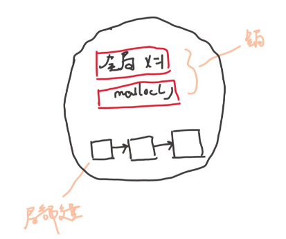
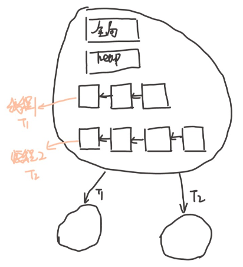
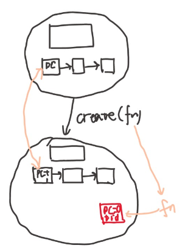
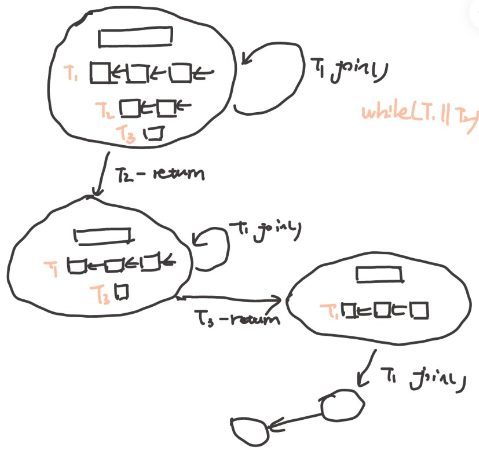
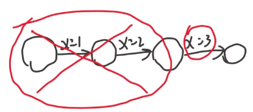

# 多处理器编程

前面理解了程序的状态机视角，以及应用视角的操作系统。

```note
应用程序只能做到计算，各种复杂功能靠系统调用实现。

正常来说，操作系统课本到这里应该开始进程了。

但是这里顺着状态机视角往下，提问题
```

这部分回答：在多处理器时代，上面的理解应该作出什么样的变化？

今天能买到的消费级别的产品，电脑，手机，几乎都是多处理器的。前面讲的是单线程的程序，如何变成多线程。


## Three Easy Pieces : 并发

**Concurrent**: existing, happening, or done *at the same time*.

In computer science, concurrency refers to the ability of different parts or units of a program, algorithm, or problem to be executed out-of-order or in partial order, without affecting the final outcome. (Wikipedia)

多处理器程序没法像顺序程序一样，

必须要接受并发，操作系统是最早的并发程序之一，系统调用的代码就是世界上最早的并发程序。

写并发程序，用好处理器。

并发的基本单位：线程。多个执行流一起往前走。
- 执行流拥有独立的堆栈/寄存器
- 共享全部的内存(指针可以互相引用)

还是要用状态机的视角来理解。单线程的状态机如何改称多线程的状态机？共享如何用状态机来刻画？

<figure>
    
    <figcaption>单线程的状态机</figcaption>
</figure>

单线程的状态机，全局变量和堆内存+栈帧，语句的执行，状态发生变化。

如果想要把单线程扩展成多线程，每个线程有自己的局部状态，自己的PC，

<figure>
    
    <figcaption>单线程的状态机</figcaption>
</figure>

内存是共享的，除此之外每个线程有自己的栈帧，这个时候并发程序的状态已经定义好了。

状态机如何执行呢？并发体现在哪里？我们的状态机在外面好像有一个选择器(switcher)来选择每个状态是T1执行还是T2执行，也就是说并发程序的每一步都是不确定的，(单线程随机数的不确定)
- 当选择T1执行的时候，把全局的状态+T1栈帧的状态，T2完全看不到，执行一步
- 选择T2执行时，全局的状态+T2栈帧的状态，T1完全看不到，执行一步

这个过程不断往复下去，并发程序的可怕之处在于，每一步都是不确定的。

人是顺序的，做完一件事再做另一件事。这就相当于强迫一个人去考虑所有的事情，人的思想负担会增加。

这个说法，看起来很简单，但是要理解还是要花点时间的。不过没关系，慢慢来。

## 简化线程api

有一个简单的多线程测试的封装好的库。

- `create(fn)` 
  - 创建一个入口函数是个fn 的线程，并立即开始执行
    - `void fn(int tid) {...}`
    - 参数从 `1` 开始
  - 语义：在状态中新增 stack frame 列表并初始化为 fn(tid)

<figure>
  
</figure>


- `join()`
  - 等待所有运行线程的 fn 返回
  - 在 main 返回时会自动等待所有线程结束
  - 语义：在有其他线程未执行完时死循环，否则返回

<figure>
  
</figure>

编译时需要增加 -lpthread


## 写点代码体验一下

```c
#include "thread.h"

void Ta() { while (1) { printf("a"); } }
void Tb() { while (1) { printf("b"); } }

int main() {
  create(Ta);
  create(Tb);
}
```

编译 `gcc -1.c -lpthread`

这个程序和以往所有的程序都是不太一样，这个程序可以把线程1放到CPU1上，线程2放到CPU2上，不仅仅是单个CPU线程之间的切换。

同时执行。

去掉printf，空的循环运行起来，可以把CPU跑到100%，打开资源管理器，可以看到有两个CPU跑满了。使用 `top` 也可以看到有个程序的CPU占用超过了100%。

- 操作系统自动的把线程放在了不同的CPU上执行
- 在后台运行，可以看到CPU使用率超过了100%！


很自然的会问，所有的东西，在同一个地址空间里吗？能问出问题，自然可以用小程序去证明。

```c
#include "thread.h"

int x = 0;

void Thello(int id) {
  usleep(id * 100000);
  printf("Hello from thread #%c\n", "123456789ABCDEF"[x++]);
}

int main() {
  for (int i = 0; i < 10; i++) {
    create(Thello);
  }
}
```

那么如何证明线程都独立的堆栈呢？

来一个小程序，去故意栈溢出，不断打印栈的大小。对于输出的结果可以用脚本稍加处理 `./a.out | sort -nk 6` 或者把输出丢到vim 里 `./a.out | vim -`

可以看出，在靠近8192kb的位置，栈溢出了。

更多的想法：
- 创建线程的是哪个系统调用？strace看一下，clone系统调用
- 能否gdb调试？

一些更多的猜想，完全可以通过gdb来看。

关于thread.h背后的东西：POSIX Threads

进一步配置线程，设置更大的线程栈，设置detach运行。POSIX为我们提供了线程库，可以查看手册 `man 7 threads`

一个小练习，改写therad，让线程有更大的栈，有1MB，或者1GB的栈。这件事情是可以做到的。

多线程有好玩的地方，但是一些麻烦也在靠近。
- 多处理器系统中的线程的代码可能同时执行
  - 两个线程同时执行 `x++` 会发生什么？
  - 同时向链表里insert，链表的结构还可以保持吗？

## 多线程的麻烦：原子性

原子性

```c
#include "thread.h"

unsigned long balance = 100;

void Alipay_withdraw(int amt) {
  if (balance >= amt) {
    usleep(1); // unexpected delays
    balance -= amt;
  }
}

void Talipay(int id) {
  Alipay_withdraw(100);
}

int main() {
  create(Talipay);
  create(Talipay);
  join();
  printf("balance = %lu\n", balance);
}
```

现在有两个线程。

可以看到结果，有时候是对的。有时候是一个特别大的数， $$ 2^{64} - 100 $$

实际软件也有这种例子，比如红色警戒“印度重工”

不管是因为线程导致的，还是事件导致的，结果很像。总之是编程不当导致的。

因为并发，求和程序都写不对
```c
#include "thread.h"

#define N 100000000

long sum = 0;

void Tsum() {
  for (int i = 0; i < N; i++) {
    sum++;
  }
}

int main() {
  create(Tsum);
  create(Tsum);
  join();
  printf("sum = %ld\n", sum);
}
```
讲道理，就算是并发，总的加的次数应该也是200000000，然而结果是100257129，执行很多次，也差的很多。

甚至直接用汇编 `asm volatile("add $1, %0": "+m"(sum));` 也是这个结果。但是用这条指令

 `asm volatile("lock add $1, %0": "+m"(sum));`  会使结果正确，然而程序执行的速度显著下降。


 并发带来的问题是连最简单的+1的原子性都做不到。我们想的是执行一条指令再接下来下一条。

**“程序 (甚至是一条指令) 独占处理器执行” 的基本假设在现代多处理器系统上不再成立。**

原子性：
- 在单处理器多线程上，线程运行时可能被终端，切换另一个线程
- 多处理器多线程，线程根本就是并行的


单处理器的话(把程序限制到一个CPU上)用一条ADD指令实现+1就正确了。但是现在的CPU都是多处理器的。

在1960s，大家争先恐后的在共享内存上实现原子性(互斥)，但几乎所有的都是错的，直到 Dekker's Algorithm，还只能保证两个线程的互斥

所以原子性是第一个在写并发程序的时候遇到的问题。

再来看看第一个例子printf出a和b，为什么每出现问题，每出现奇怪的结果，诡异的字符，这是因为printf是线程安全的，标准库考虑到了多线程的情况，他自己会保证多线程的原子性，他里面有buffer。 手册 `man 3 printf` 查找线程 `/thread` 可以看到相关内容。

互斥和原子性是重要的话题。

`lock(&lk)` 和 `unlock(&lk)` 实现临界区 (critical section) 之间的绝对串行化，程序的其他部分依然可以并行执行。

并发程序的复杂性从根本上来说对人类是 “失控” 的。但从另一个角度，人类有在另外一个维度解决这个问题的 (工程) 办法：

**作出合适的抽象，并且只写自己能控制得了的代码。**

某种程度上说，这是我们和现实世界复杂性的妥协。例如，在并发编程时总是使用线程池、队列、Map-Reduce 等容易理解的并发编程工具。此外，人类还发明了很多工具来帮助我们理解并发程序，model checker 就是其中之一。

99% 的并发问题都可以用一个队列解决
- 把大任务切分成可以并行的小任务
- worker thread 去锁保护的队列里取任务
- 除去不可并行的部分，剩下的部分可以获得线性的加速

线程池，在java里有这样的类。而且只要程序的并行度足够高，效率就会提高。

## 顺序

再回到sum.c最简单的求和，前面没加优化， `-O0`

```bash
➜  2 git:(main) ✗ gcc -O1 sum.c 
➜  2 git:(main) ✗ ./a.out 
sum = 100000000
➜  2 git:(main) ✗ gcc -O2 sum.c
➜  2 git:(main) ✗ ./a.out      
sum = 200000000
```

这个东西，就越发离谱了。

这得说回编译器了。编译器是按照顺序程序来优化程序的，C语言代码是状态机。当编译器知道变量 `x` 将来一定会是3的时候，为了加速程序运行，中间的没用状态就直接删除掉了。编译器认为系统调用是不可优化的东西，编译对内存可以做一些操作。

<figure>
  
</figure>

反汇编看一下
- -O1 : 


